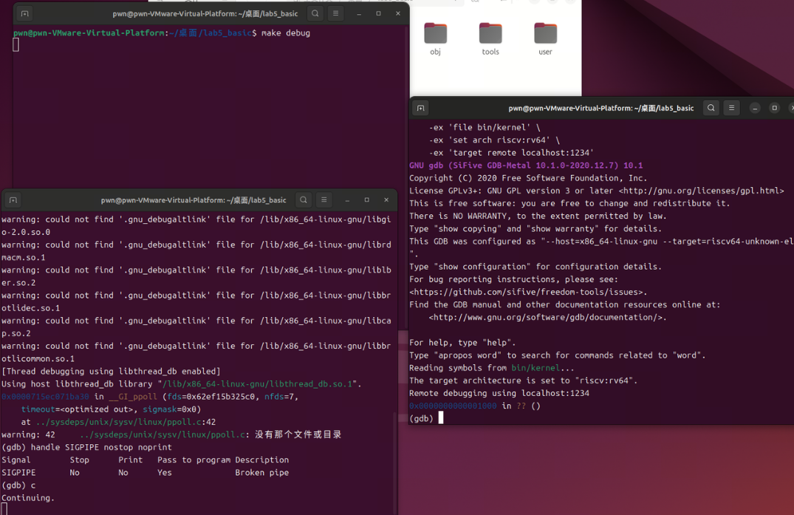
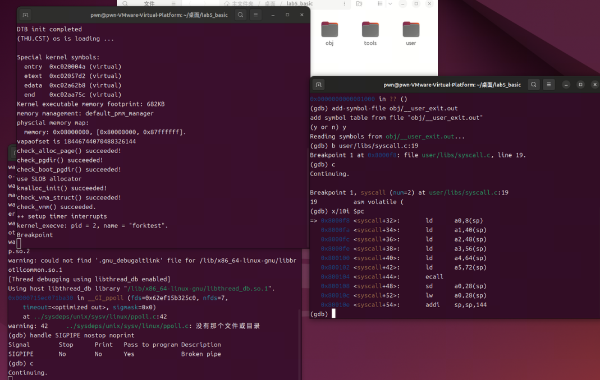
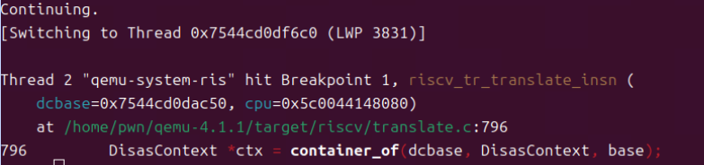
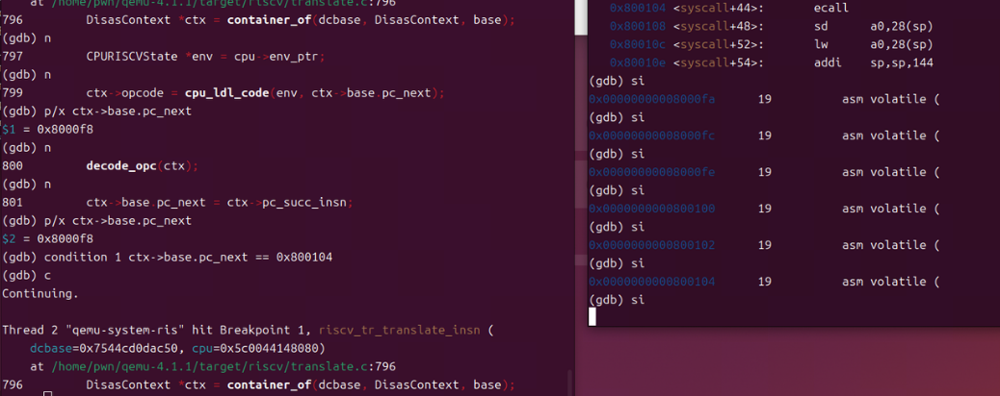
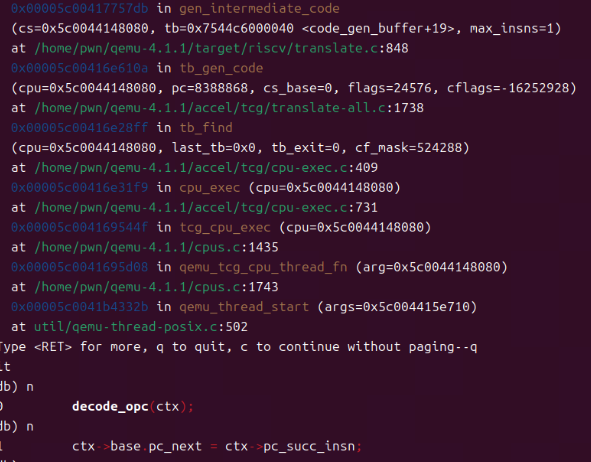
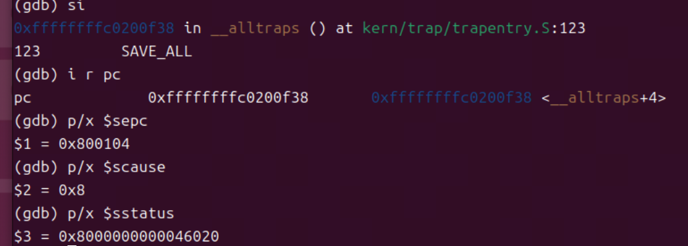
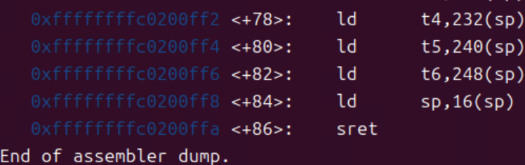
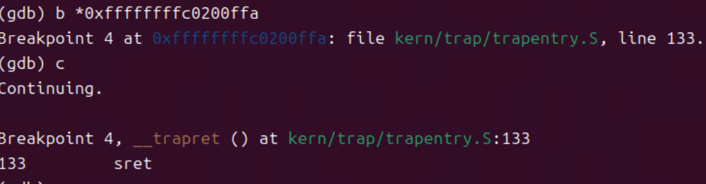
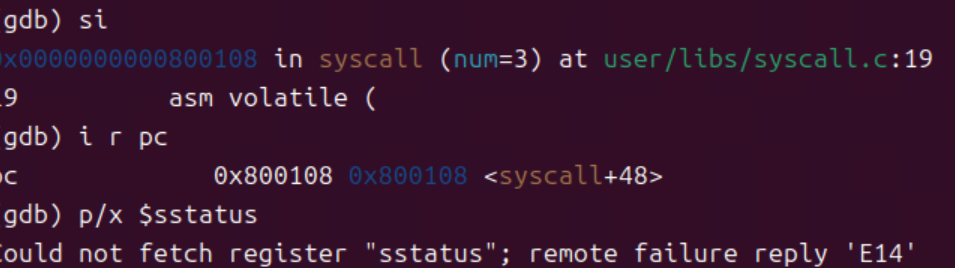

# 分支任务2（lab5）：gdb 调试系统调用及返回

依次打开三个终端

左上角终端1用于启动新编译的调试版QEMU

左下角终端2用于调试QEMU进程，主要用于观察 QEMU 如何翻译 ecall/sret
指令；观察 QEMU 如何处理异常、切换特权级、写
CSR右侧终端3用于调试ucore内核

由于要调试用户程序，因此需要手动加载用户程序的符号add-symbol-file
obj/\_\_user_exit.out

加载后就可以在用户空间代码里打断点，比如在 syscall 函数处

用户程序在 0x800104 处执行 ecall ，把这个地址告诉终端2，让 QEMU
只在翻译这条 ecall 时停住。

回到终端2，先按 Ctrl + C 打断 QEMU，让 gdb 回到 (gdb)
提示符。然后在翻译函数处打上断点b riscv_tr_translate_insn，继续执行

让其只在翻译 PC=0x800104 时停止condition 1 ctx-\>base.pc_next ==
0x800104，继续执行

此时终端3还停在 ecall 之前的 C 语句，再重复执行si，发出ecall指令，此时：

guest 角度：CPU 执行 ecall

QEMU 角度：把这条 ecall 翻译成 TCG 或执行已经翻译好的 TB

终端2会在翻译这条 ecall 指令时自动暂停

可以看到单步C代码和调用栈，例如图中decode_opc(ctx); 里识别 opcode 是
SYSTEM、funct3/imm 对应 ECALL

随后在终端2继续执行，抛出异常，CPU 进入内核 trap。此时 PC 已经不再是
0x800104，而是跳到了内核的 trap 入口（ S 态），并且CSR 也被写好

这就是从用户态执行 ecall → QEMU 模拟硬件 → 进入内核态的流程。

接下来是从内核返回用户态的调试流程

先在终端3中设置断点b
\_\_trapret并执行，使用disassemble展示全部反汇编指令，可以看到sret的位置

继续打断点并执行，可以使用x/3i \$pc看到暂停在sret之前

可以查看当前CSR

![](img/media/image9.png）

接下来继续执行si，pc 从 0xffffffffc0200ffa 跳到了 0x800108

并且由于sret 已经带回 U 态用户模式 了，所以此时 QEMU 的 gdb stub 对某些
特权寄存器（CSR） 做了限制。 在 U 模式下，gdb 不允许直接访问 S 态的
sstatus，于是返回了 \'E14\' 错误。

思考：

1\. ecall和sret指令在qemu中的处理流程

ecall指令：在用户态执行ecall时，qemu通过TCG机制捕获到该指令。TCG会将RISC-V的ecall指令翻译为宿主机的异常处理流程，模拟CPU陷入内核态，跳转到trap入口，进入内核trap处理函数

sret指令：当内核处理完系统调用后，执行sret指令。qemu同样通过TCG捕获sret，模拟CPU从S态返回U态，恢复用户程序的上下文，继续执行用户代码。

2\. qemu的TCG机制

TCG是qemu的动态二进制翻译引擎。它会把RISC-V等目标架构的指令翻译成宿主机（如x86）的指令。

当遇到特权指令时，TCG会调用qemu内部的C函数（如helper_ecall、helper_sret），这些函数负责模拟硬件的特权级切换、异常处理等行为。

这保证了即使在x86主机上，也能完整模拟RISC-V的trap、系统调用和返回流程。

3.双gdb调试与TCG的关系

双gdb调试（一个gdb调内核、一个gdb调qemu）可以精确观察qemu如何模拟RISC-V指令，尤其是trap、ecall、sret等关键流程。

通过双gdb，可以在qemu源码中设置断点，跟踪TCG翻译和helper函数的执行过程，深入理解qemu的指令模拟机制。

4\. 调试过程中的有趣细节

发现gdb无法直接识别用户程序符号，需要手动add-symbol-file加载。

单步执行到ecall时，可以看到寄存器和特权级的实时变化，直观理解trap机制。

qemu的TCG机制让不同架构的指令能在x86主机上无缝运行，极大地方便了操作系统实验和调试。
